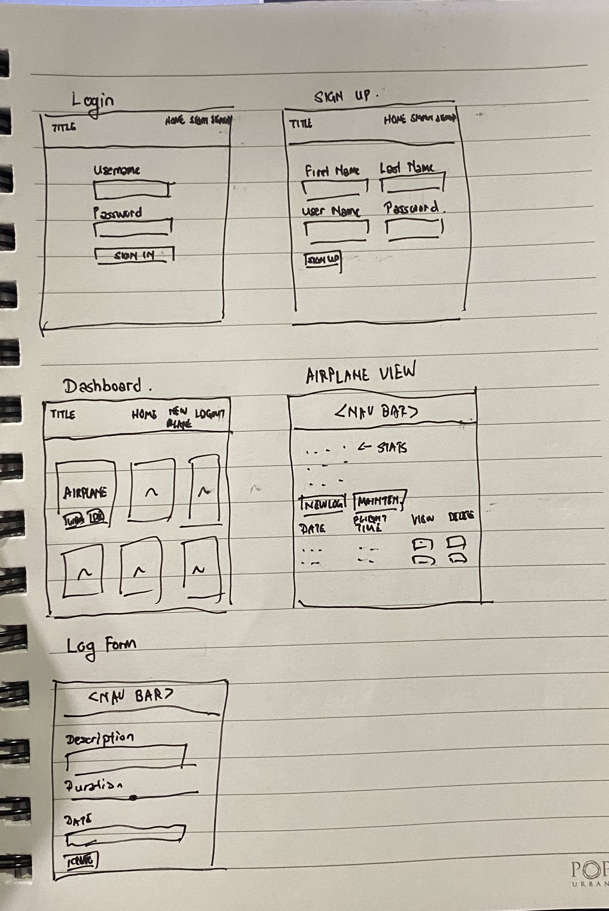

# SEI-23 Project #2: RC-Flight-Log

## Problem

As a hobbyist in the field of Radio-Controlled Airplanes, I often lose track of when to service the aircraft - most often just the engine. Forgetting to maintain them leads to increased wear in the parts and failures in flight, which more than often ends in a crash.

### The Solution!

The app is designed so that I can log flights as soon as they are completed, or at the end of each flying day. The total flight time for each airplane is checked against the service interval to determine if the airplane is in need of maintenance. Simple! and no more mid-flight engine failures!

## Approach

Game was chosen due to the simple game mechanics and the ability to extend
functionality relatively easily. I started by defining the canvas size and 
worked on getting the code to draw the ball in it. The next step was to start animating the ball and getting collision detection on all 4 sides of the canvas screen. From there, all the remaining features were added after testing each one. Ran into some issues with game logic when I was working on the furthers, hence I decided to rewrite the script from scratch and implemented classes/objects to allow for better scaling of features. From there I could add in new physics options, track multiple balls on the screen and have better scoring.

### Tech used

To implement this app, I used :
* HTML, EJS, Bootstrap to build and style the pages.
* JavaScript/JQuery to handle DOM and tally the total flight times. 
* mongoDB/mongoose to store data entered by the user 
* Node.js / Express to handle the data being sent to the database and user.

## Unsolved problems / extra planned features

No real issues with the app currently, was planning to add QR codes to allow instant logging of the flight since all registered aircraft have a QR tag on them. Will implement this some time in the future.

### Wireframe

### App Link

[https://github.com/zeniethlily/RC-Flight-Log](http://zenlilsei23.herokuapp.com/)

